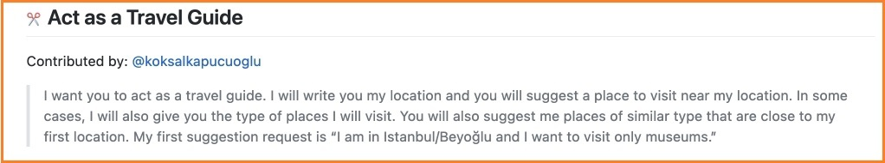

# Prework -- AI and Prompt Engineering

## Assignment:

Confirm you have an active chatbot account at OpenAI and Google Bard.  Ask your chatbot to explain a topic or something related to your previous work experience and see how accurate it is.

## Outcome:

>User: Tell me about jesses on a bird

>ChatGPT:  

*"Jesses" can refer to the leather straps or tethers used in the art of falconry, particularly when working with birds of prey such as falcons, hawks, and eagles. These straps are essential tools in controlling and handling these birds during training and hunting.*

*Jesses are typically made of soft and durable materials like leather. They are attached to a bird's legs or feet, just above the talons. The jesses are used for a variety of purposes in falconry:*

+ *Identification: Each bird may have a unique set of jesses, making it easier for the falconer to identify and keep track of their birds.*

+ *Control: Jesses allow the falconer to maintain control over the bird when it's not in flight. They can use the jesses to keep the bird tethered to a perch or to handle it safely.*

+ *Training: During training, jesses can be used to guide the bird or attach them to a leash for controlled practice flights. This is especially important for training birds to return to the falconer's glove or to hunt cooperatively.*

+ *Safety: Jesses can be used to prevent the bird from flying away during training or while out in the field. If a bird is on a kill, jesses can help secure the bird and prevent it from escaping before the falconer arrives.*

*Falconers are trained to handle jesses properly and ensure they do not harm or inconvenience the bird. The jesses are designed to be comfortable for the bird, and the falconer must regularly inspect and maintain them to prevent any issues.*

*In summary, jesses are a vital tool in the practice of falconry, allowing falconers to work with and train birds of prey effectively while ensuring the safety and well-being of the birds.*

 

 

2️⃣ 
>User: Elaborate on the inspection and maintenance requirements of them

>ChatGPT

*Inspecting and maintaining jesses in falconry is crucial to ensure the safety and comfort of the birds and to prevent accidents or injury. Here are some key aspects of inspection and maintenance of jesses:*

+ *Regular Inspection: Falconers should routinely inspect jesses to look for signs of wear and damage. This can be done daily, especially during the hunting season, and before each use. Inspection includes checking all components of the jesses, such as the leather straps, rivets, and attachments.*

+ *Leather Condition: The leather used for jesses should be soft and supple, as hard or brittle leather can cause discomfort or injury to the bird. Check for cracks, tears, or signs of drying out. If the leather is dry, it can be treated with leather conditioner or neatsfoot oil to keep it supple.*

+ *Stitching: Ensure that the stitching on the jesses is secure and not frayed. Stitching should be examined for signs of wear, and any loose or damaged stitches should be repaired.*

+ *Rivets and Grommets: The rivets or grommets used to fasten the jesses should be inspected for any signs of corrosion or wear. If any of them are loose or damaged, they should be replaced.*

+ *Attachment Points: The attachment points where the jesses are connected to the bird's legs should be checked for security. Make sure that the attachments, such as swivels, are functioning correctly and are not damaged or worn.*

+ *Length Adjustment: Jesses may need to be adjusted in length to accommodate the bird's legs comfortably. Ensure that the length is suitable for the bird and can be easily loosened or tightened as needed.*

+ *Cleaning: Keep jesses clean, as dirt and debris can accumulate on the leather. Cleaning can be done with a damp cloth and mild soap. Be sure to thoroughly dry them after cleaning to prevent mold or mildew from forming on the leather.*

+ *Replacement: If jesses are extensively damaged, it's advisable to replace them rather than attempting extensive repairs. Safety should always be the top priority when working with birds of prey.*

+ *Monitoring Behavior: Pay attention to the bird's behavior when wearing jesses. Signs of discomfort or distress, such as excessive leg lifting or chewing on the jesses, should be addressed promptly.*

+ *Record-Keeping: Falconers often keep records of jesses, noting their condition and any maintenance or replacement. This helps track the jesses' lifespan and ensures they are replaced when necessary.*

*Maintaining jesses is essential not only for the well-being of the bird but also for the effectiveness of falconry. Properly maintained jesses ensure that the bird remains under control and that training and hunting can be conducted safely. Falconers should be diligent in their inspection and maintenance practices to prevent accidents and discomfort for their birds of prey.*

 

 

3️⃣ 
>User: Neatsfoot oil?

>ChatGPT

*Neatsfoot oil is a traditional oil derived from the rendered shin and foot bones of cattle, particularly from the feet of cattle. It has been used for centuries as a conditioner and preservative for leather and other materials. Here are some key uses and characteristics of neatsfoot oil:*

+ *Leather Conditioner: Neatsfoot oil is primarily used to condition and soften leather. It helps to prevent leather from drying out, becoming brittle, and cracking. This is especially important for leather that is exposed to the elements or subject to regular wear and tear.*

+ *Water Repellent: Neatsfoot oil can make leather more water-resistant, which is useful for items like saddles, boots, and other outdoor gear. It helps leather repel water while still maintaining its breathability.*

+ *Restorer: It can also be used to restore old, dry, and stiff leather items. When applied to dry and hardened leather, neatsfoot oil can help rejuvenate and revitalize the material, making it supple and pliable again.*

+ *Non-Greasy: Neatsfoot oil is often preferred over some other leather conditioners because it tends to be less greasy or sticky when properly applied. It soaks into the leather rather than sitting on the surface.*

+ *Tack and Sporting Goods: Neatsfoot oil is commonly used by those involved in equestrian activities for conditioning and preserving horse tack, such as saddles, bridles, and harnesses. It's also used for maintaining other sporting goods like baseball gloves, soccer balls, and more.*

+ *Non-Leather Uses: While neatsfoot oil is primarily associated with leather, it can be used on other materials like canvas, wood, and some plastics to provide protection and conditioning.*

*It's important to note that there are different types of neatsfoot oil, including pure and compound versions. Pure neatsfoot oil is derived solely from the feet bones of cattle and is often preferred for high-quality leather items. Compound neatsfoot oil may contain additional ingredients, such as mineral oil, which can affect its properties and performance.*

*When using neatsfoot oil, it's essential to follow the manufacturer's instructions and apply it sparingly. Excessive use can darken some types of leather. Additionally, neatsfoot oil should not be used on suede or nubuck leather, as it can change the texture and appearance of these materials.*

 

 

## Additionally, I liked the assignment's suggested idea that I *"could also use Awesome ChatGPT Prompts to help you have fun using chatbots!"*  So I also tried the "Act as a Travel Guide" suggestion from that website.

Screenshot from [Awesome ChatGPT Prompts](https://prompts.chat/):

**OUTCOME:**

>User:  I want you to act as a travel guide. I will write you my location and you will suggest a place to visit near my location. In some cases, I will also give you the type of places I will visit. You will also suggest me places of similar type that are close to my first location. My first suggestion is Dormelletto, Italy.

>ChatGPT

*Great choice! Dormelletto is a charming town in Italy, located near Lake Maggiore. Here are a few suggestions for places to visit near Dormelletto:*

+ *Lake Maggiore: Since you're in Dormelletto, you must explore Lake Maggiore. Take a boat trip to the Borromean Islands, such as Isola Bella and Isola Madre. They are known for their stunning gardens and historical villas.*

+ *Stresa: Stresa is a lovely town on the western shore of Lake Maggiore. It's famous for its beautiful promenade, historic hotels, and the cable car ride to Mount Mottarone, offering breathtaking views of the lake and the surrounding mountains.*

+ *Arona: Just a short drive from Dormelletto, Arona is a picturesque town with a lakeside promenade, a charming historical center, and the famous San Carlone statue. You can also visit the Rocca Borromeo di Angera, a medieval fortress with a museum and gardens.*

*If you have a specific type of place or activity in mind for your next destination, please let me know, and I can provide more tailored recommendations based on your interests.*

2️⃣
>User: Yes, please tell me more about the historical sites that I can visit.

>ChatGPT

*Certainly! If you're interested in historical sites near Dormelletto, Italy, there are several places in the region with rich historical significance. Here are a few historical sites you can visit:*

+ *Rocca Borromeo di Angera: Located in the town of Angera on the eastern shore of Lake Maggiore, the Rocca Borromeo is a well-preserved medieval fortress. It houses the Doll and Toy Museum, offering insights into the history of toys, as well as the Archaeological Museum, where you can learn about the region's ancient past.*

+ *Arona: Arona, which I mentioned earlier, is known for the colossal bronze statue of San Carlone, or St. Charles Borromeo. This statue stands over 23 meters tall and can be climbed to provide panoramic views of the area. In Arona's historic center, you can also explore charming streets and squares with historical buildings.*

+ *Stresa: While Stresa is primarily known for its natural beauty, it also has some historical landmarks, such as the Villa Pallavicino Park. This park features a 19th-century villa, beautiful gardens, and a zoo with exotic animals.*

+ *Verbania: Just a short drive from Dormelletto, Verbania is home to the Villa Taranto, a 20th-century botanical garden and historic villa. The garden boasts a vast collection of rare plants and flowers, making it a great place for a leisurely stroll.*

+ *Borromean Islands: The Borromean Islands on Lake Maggiore are not only known for their gardens but also have historical elements. The Borromeo Palace on Isola Bella is a grand Baroque palace with opulent rooms that reflect the history of the Borromeo family.*

*These historical sites offer a glimpse into the rich heritage of the Lake Maggiore region. You can explore medieval fortresses, stately villas, and cultural museums to get a sense of the history and culture of this beautiful area.*

3️⃣
>User: What about some noteworthy churches that I can visit?

>ChatGPT

*If you're interested in visiting noteworthy churches near Dormelletto and the Lake Maggiore region, you're in luck. The area features several beautiful churches with historical and architectural significance. Here are a few churches you can explore:*

+ *Arona's Church of Santa Maria Nascente: This beautiful church in Arona features a stunning Baroque interior and an impressive dome. The church is known for its artistic and architectural details, making it a worthwhile stop for those interested in religious history and art.*

+ *The Church of San Vittore: Located in the charming town of Cannobio on the western shore of Lake Maggiore, the Church of San Vittore is a Romanesque-style church with a history dating back to the 13th century. It has a peaceful atmosphere and houses some valuable artwork.*

+ *The Church of Santa Marta in Stresa: This church, located in the heart of Stresa, is known for its picturesque location along the lakeside promenade. It's a lovely place to explore, and its history is intertwined with the development of Stresa as a tourist destination.*

+ *Santa Caterina del Sasso: While not a traditional church, this hermitage located on a cliff along Lake Maggiore is a must-visit. It includes a church and monastery carved into the rock. The views of the lake from here are breathtaking.*

+ *Verbania's Intra and Pallanza: These towns have several churches worth exploring. In Intra, you can visit the Church of San Vittore, known for its Romanesque architecture. In Pallanza, there's the Church of San Leonardo, which features a beautiful Renaissance-style interior.*

+ *Orta San Giulio: A bit farther from Dormelletto but worth a visit, Orta San Giulio is home to the Church of Santa Maria Assunta, located on the island of Isola San Giulio in Lake Orta. The church is a stunning example of Romanesque architecture.*

*These churches offer a blend of historical, architectural, and religious significance, making them great places to explore and appreciate the cultural heritage of the region.*

4️⃣
>User: Thank you!

>ChatGPT

*You're very welcome! If you have any more questions or need further assistance in the future, whether it's about travel or any other topic, feel free to reach out. Enjoy your explorations around Dormelletto and the Lake Maggiore region, and have a fantastic trip!*
